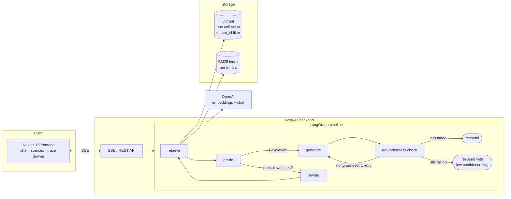
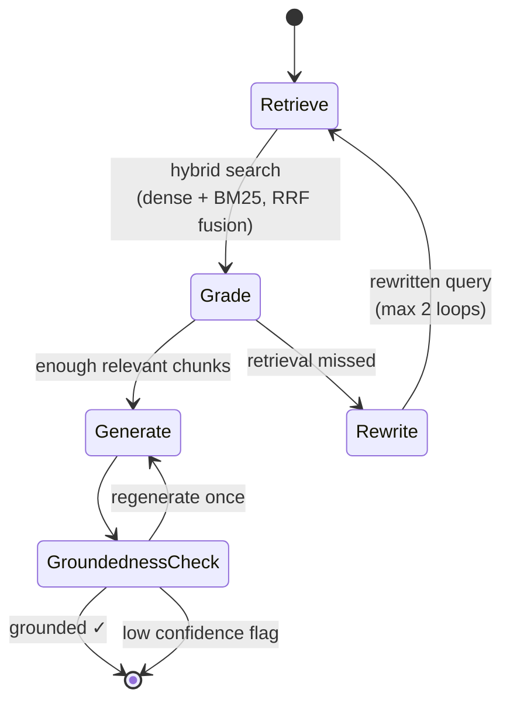

<div align="center">

<picture>
  <source media="(prefers-color-scheme: dark)" srcset="assets/logo-dark.svg">
  
</picture>

<br/>

**A multi tenant RAG engine that grades its own retrieval, rewrites failed queries, and verifies every answer against the sources before you ever see it.**

[](https://www.python.org/)
[](https://nextjs.org/)
[](https://github.com/langchain-ai/langgraph)
[](LICENSE)

<!-- [**Live Demo**](https://grounded-rag.vercel.app) ·  -->

[**Eval Results**](#evaluation-results) · [**Architecture**](#architecture) · [**Quickstart**](#quickstart)

<!-- TODO: record and embed demo GIF here after deploy -->
<!--  -->

</div>

---

## Why this exists

Most RAG demos share the same four weaknesses: one user, dense retrieval only, no idea when retrieval failed, and answers returned unverified. GroundedRAG is a reference implementation of the four patterns that separate a demo from a production system:

| Pattern                       | What it means here                                                                                                                                                              |
| ----------------------------- | ------------------------------------------------------------------------------------------------------------------------------------------------------------------------------- |
| **Multi tenancy**             | One Qdrant collection serves every tenant, isolated by a mandatory payload filter. Tenant A's documents can never leak into tenant B's answers. There is a test that proves it. |
| **Hybrid retrieval**          | Dense embeddings catch meaning. BM25 catches exact terms like invoice numbers and product codes. Results are fused with Reciprocal Rank Fusion.                                 |
| **Self correction**           | An LLM grading node scores every retrieved chunk. If retrieval missed, the query is rewritten and retrieval runs again, capped at 2 loops.                                      |
| **Groundedness verification** | Before any answer is returned, a check node verifies it is supported by the cited chunks. Failed answers regenerate once, then ship with a low confidence flag.                 |

Every answer comes with a full **trace**: what was retrieved, how each chunk was graded, whether the query was rewritten, and the groundedness verdict. Open the trace drawer in the demo and watch the pipeline think.

The project also ships an evaluation harness and a scale benchmark, and publishes what they measured, including the parts that did not go the way the design predicted. See [Evaluation results](#evaluation-results).

## Architecture



### The self correcting loop in detail



Hard limits are enforced in code: maximum 2 rewrites, maximum 1 regeneration. The loop can never run unbounded.

The answer streams to the user only after the correction loop settles. Forwarding the model's tokens live during generation would put a first attempt on screen that the groundedness check might then reject. An unverified answer never reaches the user.

## Evaluation results

The harness runs a golden set of 45 questions through the full pipeline twice, once with the correction loop ON and once with it OFF (grading, rewrite, and groundedness nodes bypassed). Questions are tagged by category: 25 baseline, 6 `rewrite_bait` (deliberately vague or abbreviated phrasing), 5 `multi_chunk` (answers spanning two documents), 5 `distractor_trap` (a plausible wrong answer sits nearby in the corpus), and 4 `near_miss_unanswerable` (topically adjacent but genuinely absent).

Numbers below are the mean of two independent full runs on identical code, with min and max shown so run to run noise is visible rather than hidden. Generated by the harness, never typed by hand.

| Metric              | Correction OFF (mean, min–max) | Correction ON (mean, min–max) | Delta  |
| ------------------- | ------------------------------ | ----------------------------- | ------ |
| Retrieval hit rate  | 100.0% (100.0–100.0%)          | 98.6% (97.2–100.0%)           | -1.4pp |
| Groundedness rate   | 96.7% (93.3–100.0%)            | 93.3% (91.1–95.6%)            | -3.3pp |
| "Not found" honesty | 100.0% (100.0–100.0%)          | 100.0% (100.0–100.0%)         | +0.0pp |

Judge agreement, meaning how often the pipeline's own internal groundedness check agrees with the independent eval judge: **84.4%** (76 of 90 answers across both runs).

Full per category breakdown, methodology, and limitations: [`backend/app/eval/RESULTS.md`](backend/app/eval/RESULTS.md).

### What the evaluation actually found

**The correction loop did not improve groundedness on this corpus.** Every delta above is zero or negative. The honest reason is visible in the baseline category: groundedness is already 98% without any correction, because the seeded documents are clean, well structured, and unambiguous. A safety net under someone walking on the floor catches nothing. The loop's design target is messy queries over messy corpora, and this corpus is neither.

**Per category deltas at these sample sizes are noise.** With 5 or 6 questions per category, one question flipping moves the rate 17 to 20 points. Running the harness twice on identical code produced a 33.3pp swing in `rewrite_bait` groundedness. Only the 25 question baseline category and the overall aggregate are stable enough to read a direction from. An earlier attempt to tune the grading and generator prompts against a single noisy run made the grader globally conservative, tripled rewrites on easy questions, and dragged retrieval down through query drift. It was reverted. Tuning stopped there, deliberately.

**The measured win was elsewhere.** The pipeline's internal groundedness check previously asked the model to emit its `grounded` verdict alongside its claim extraction. Structured output fields decode in schema declaration order, so the model committed to a verdict before performing the extraction meant to justify it, and periodically contradicted itself. Deriving `grounded` in code from whether the extracted `unsupported_claims` list is empty made the contradiction structurally impossible. Agreement with the independent judge rose from 60% to 84.4%. The same bug, found first in the eval judge itself, is why the judge no longer emits a verdict either.

**Two multi hop failure mechanisms are diagnosed and open.** Both are documented with full transcripts in [`backend/app/eval/transcripts/`](backend/app/eval/transcripts/):

1. _Generation level figure substitution._ Asked how far in advance a five day PTO request must be submitted, the model answered "30 days" where the source says "15 business days," lifting an unrelated 30 day figure from elsewhere in the same chunk, and repeated it after a forced regeneration. Retrieval and grading were both correct.
2. _Claim to source attribution across overlapping chunks._ The judge marked a claim unsupported that appears verbatim in two overlapping windowed chunks, both retrieved and both graded relevant. Duplicate chunk boundaries confuse attribution.

Reproduce, at the cost of real OpenAI credits:

```bash
cd backend && python -m app.eval.run
```

## Performance

Measured, not assumed. Ingestion sustains roughly 430 documents per second flat from 1,000 to 50,000 documents. Hybrid search serves p95 under 10ms at 1,000 documents and under 45ms at 10,000, covering the realistic multi tenant document QA range with headroom. At 50,000 documents in a single tenant (115k chunks) the in process BM25 index becomes the ceiling, at 3.8GB memory and roughly 230ms p95, which is why the roadmap's next architectural step is Qdrant sparse vectors replacing in process BM25. Full methodology and results in [`backend/benchmarks/RESULTS.md`](backend/benchmarks/RESULTS.md). The benchmark also caught a pagination bug in cold index rebuilds before release, which is the point of having one.

## Quickstart

**Prerequisites:** Python 3.11+, Node 20+, Docker, an OpenAI API key.

```bash
git clone https://github.com/AsadSolutions/grounded-rag.git
cd grounded-rag

# 1. Start Qdrant
docker compose up -d qdrant

# 2. Backend
cd backend
python3 -m venv .venv
source .venv/bin/activate
pip install -r requirements.txt
cp .env.example .env        # add your OPENAI_API_KEY
python -m app.ingest.seed   # loads the demo tenants into Qdrant
uvicorn app.main:app --reload

# 3. Frontend (new terminal)
cd frontend
npm install
cp .env.example .env.local
npm run dev                  # http://localhost:3000
```

**No backend, no API key, no Docker?** Set `NEXT_PUBLIC_USE_MOCKS=true` in `frontend/.env.local` and run `npm run dev`. The entire UI, including the trace drawer, runs against realistic fixture data.

### Other commands

```bash
# Backend unit tests
cd backend && pytest

# Eval harness. Costs real OpenAI credits (embeddings + chat + judge calls).
cd backend && python -m app.eval.run

# Scale benchmark. Uses a fake embedder, no OpenAI calls, no cost.
cd backend && python -m benchmarks.run --docs 1000
```

The test suite includes `tests/test_tenant_isolation.py`, which uploads documents as two tenants and proves queries never cross the boundary, including adversarial cases with near duplicate content.

## Project structure

```
grounded-rag/
  assets/                    logo and brand files
  backend/
    app/
      ingest/                extract, chunk, embed, upsert, seed
      retrieval/             dense, keyword (BM25), hybrid (RRF)
      graph/                 LangGraph nodes and wiring
      eval/                  golden set, LLM judge, runner, RESULTS.md, transcripts
      routers/               tenants, documents, chat, eval
      config.py  models.py  qdrant_client.py  tenant_guard.py  main.py
    benchmarks/              scale benchmark and its RESULTS.md
    seed_docs/               original fictional corpus for the two demo tenants
    tests/
  frontend/                  Next.js 15, App Router, Tailwind, hand built components
    app/  components/  lib/  public/
  docker-compose.yml
```

## Design decisions

**One collection, not one per tenant.** Per tenant collections look safer but do not scale operationally past a handful of tenants. Payload filtering is the pattern real multi tenant systems use, so that is the pattern demonstrated, backed by an isolation test rather than by trust.

**RRF instead of weighted score fusion.** Dense scores and BM25 scores live on incompatible scales. Reciprocal Rank Fusion only uses ranks, needs no tuning, and is robust to either retriever having a bad day.

**Hard loop limits.** Self correcting pipelines fail in production by looping. Two rewrites and one regeneration, then the system returns its best effort with an honest flag. Bounded cost, bounded latency.

**The judge never emits its own verdict.** It extracts unsupported claims; `grounded` is derived in code as "the list is empty." Structured output decodes fields in declaration order, so a verdict field asked for first is a verdict formed before the reasoning that justifies it. This was a real bug, found because the judge's stated reason contradicted its own verdict.

**Chat history lives in the browser, not the server.** Persistence must match the authentication model. With no accounts there is no authenticated owner for a conversation, no deletion story, and transcripts contain document excerpts. The server stores documents; the browser stores conversations. With auth in front, threads move to Postgres without touching the pipeline.

**No authentication, and it says so.** A tenant id is an unguessable random string held in the browser. Possession is access. That is honest security for a public demo, and it is documented rather than dressed up. Scratch tenants expire server side after 24 hours.

**The trace is a feature, not a debug tool.** If a RAG system cannot show why it answered what it answered, you cannot debug it, and users cannot trust it. The trace drawer is the product.

## Known limitations

- No authentication, no user accounts, no document level permissions. All three are meaningless without user identities. The upgrade path is an ACL field in chunk metadata enforced by the same payload filter that already runs on every query.
- No conversational memory. Every question is answered independently from the documents.
- Uploads are synchronous in the request. Bulk ingestion belongs in a job queue; `app/ingest/seed.py` shows the batched pattern.
- PDF, TXT, and Markdown only. No OCR.
- The two multi hop failure mechanisms above are diagnosed, documented, and unfixed.

## Stack

FastAPI · LangChain · LangGraph · OpenAI · Qdrant · rank-bm25 · Pydantic · Next.js 15 · TypeScript · Tailwind CSS

## License

MIT — see [LICENSE](LICENSE).

---

<div align="center">

Built by [Muhammad Asad Saeed](https://asadsaeed.info) · [LinkedIn](https://linkedin.com/in/asad-saeed060) · [GitHub](https://github.com/AsadSolutions)

</div>
