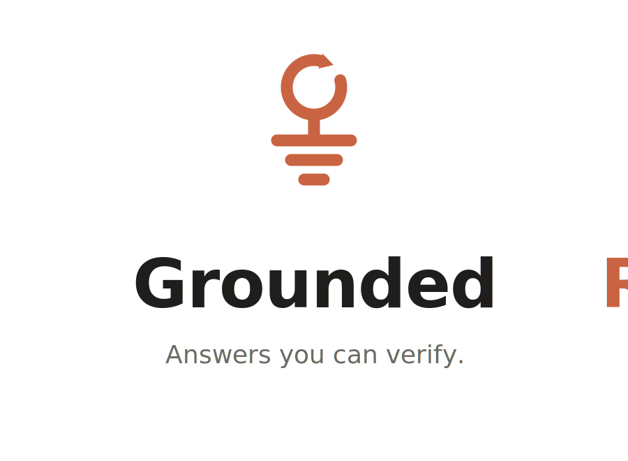
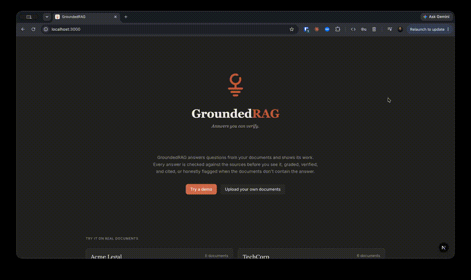
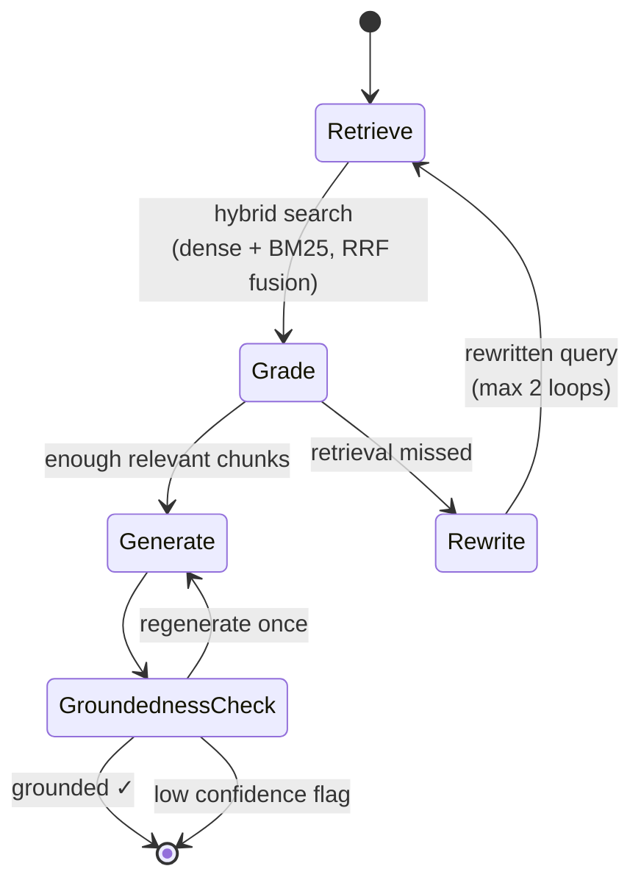

<div align="center">

<picture>
  <source media="(prefers-color-scheme: dark)" srcset="assets/logo-dark.svg">
  
</picture>

<br/>

**A multi tenant RAG engine that grades its own retrieval, rewrites failed queries, and verifies every answer against the sources before you ever see it.**

[](https://www.python.org/)
[](https://nextjs.org/)
[](https://github.com/langchain-ai/langgraph)
[](LICENSE)

[**Live Demo**](https://grounded-rag.vercel.app) · [**Eval Results**](#evaluation-results) · [**Architecture**](#architecture) · [**Quickstart**](#quickstart)

<!-- TODO: record and embed demo GIF here after deploy -->
<!--  -->

</div>

---

## Why this exists

Most RAG demos share the same four weaknesses: one user, dense retrieval only, no idea when retrieval failed, and answers returned unverified. GroundedRAG is a reference implementation of the four patterns that separate a demo from a production system:

| Pattern                       | What it means here                                                                                                                                                              |
| ----------------------------- | ------------------------------------------------------------------------------------------------------------------------------------------------------------------------------- |
| **Multi tenancy**             | One Qdrant collection serves every tenant, isolated by a mandatory payload filter. Tenant A's documents can never leak into tenant B's answers. There is a test that proves it. |
| **Hybrid retrieval**          | Dense embeddings catch meaning. BM25 catches exact terms like invoice numbers and product codes. Results are fused with Reciprocal Rank Fusion.                                 |
| **Self correction**           | An LLM grading node scores every retrieved chunk. If retrieval missed, the query is rewritten and retrieval runs again, capped at 2 loops.                                      |
| **Groundedness verification** | Before any answer is returned, a check node verifies it is supported by the cited chunks. Failed answers regenerate once, then ship with a low confidence flag.                 |

Every answer comes with a full **trace**: what was retrieved, how each chunk was graded, whether the query was rewritten, and the groundedness verdict. Open the trace drawer in the demo and watch the pipeline think.

## Architecture


### The self correcting loop in detail



Hard limits are enforced in code: maximum 2 rewrites, maximum 1 regeneration. The loop can never run unbounded.

## Evaluation results

The eval harness runs a golden set of 25+ questions (including 5 deliberately unanswerable ones) through the full pipeline twice: with the correction loop ON and OFF.

<!-- TODO: this table is generated by `python -m app.eval.run` and pasted from eval/RESULTS.md. Do not edit by hand. -->

| Metric              | Correction OFF | Correction ON |
| ------------------- | -------------- | ------------- |
| Retrieval hit rate  | _pending_      | _pending_     |
| Groundedness rate   | _pending_      | _pending_     |
| "Not found" honesty | _pending_      | _pending_     |

**Metrics explained.** Retrieval hit rate: the fraction of questions where at least one golden chunk was retrieved. Groundedness rate: the fraction of answers an independent LLM judge marks as fully supported by the cited sources. "Not found" honesty: whether the system admits when the documents do not contain the answer instead of hallucinating one.

Reproduce with one command:

```bash
cd backend && python -m app.eval.run
```

## Quickstart

**Prerequisites:** Python 3.11+, Node 20+, Docker, an OpenAI API key.

```bash
git clone https://github.com/AsadSolutions/grounded-rag.git
cd grounded-rag

# 1. Start Qdrant
docker compose up -d qdrant

# 2. Backend
cd backend
cp .env.example .env        # add your OPENAI_API_KEY
pip install -e .
uvicorn app.main:app --reload

# 3. Frontend (new terminal)
cd frontend
npm install
npm run dev                  # http://localhost:3000
```

Run the tests:

```bash
cd backend && pytest
```

The test suite includes `test_tenant_isolation.py`, which uploads documents as two tenants and proves queries never cross the boundary.

## Project structure

```
grounded-rag/
  backend/
    app/
      ingest/        extract, chunk, embed, upsert
      retrieval/     dense, keyword (BM25), hybrid (RRF)
      graph/         LangGraph nodes and wiring
      eval/          golden set, LLM judge, runner
      routers/       tenants, documents, chat, eval
    tests/
  frontend/          Next.js 15, App Router, Tailwind, shadcn/ui
  docs/              assets/  logo, brand files
```

## Design decisions

**One collection, not one per tenant.** Per tenant collections look safer but do not scale operationally past a handful of tenants. Payload filtering is the pattern real multi tenant systems use, so that is the pattern demonstrated, backed by an isolation test rather than by trust.

**RRF instead of weighted score fusion.** Dense scores and BM25 scores live on incompatible scales. Reciprocal Rank Fusion only uses ranks, needs no tuning, and is robust to either retriever having a bad day.

**Hard loop limits.** Self correcting pipelines fail in production by looping. Two rewrites and one regeneration, then the system returns its best effort with an honest flag. Bounded cost, bounded latency.

**The trace is a feature, not a debug tool.** If a RAG system cannot show why it answered what it answered, you cannot debug it, and users cannot trust it. The trace drawer is the product.

## Stack

FastAPI · LangChain · LangGraph · OpenAI · Qdrant · rank-bm25 · Pydantic · Next.js 15 · TypeScript · Tailwind CSS · shadcn/ui

## License

MIT — see [LICENSE](LICENSE).

---

<div align="center">

Built by [Muhammad Asad Saeed](https://asadsaeed.info) · [LinkedIn](https://linkedin.com/in/asad-saeed060) · [GitHub](https://github.com/AsadSolutions)

</div>
